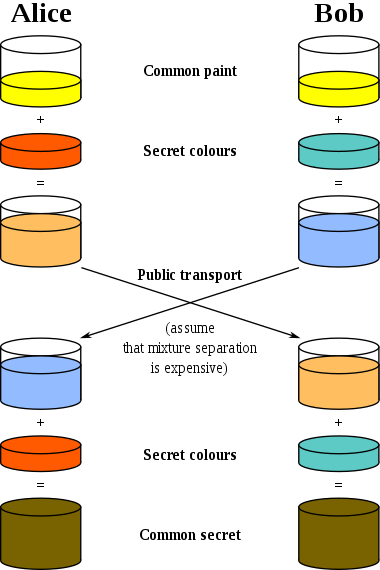
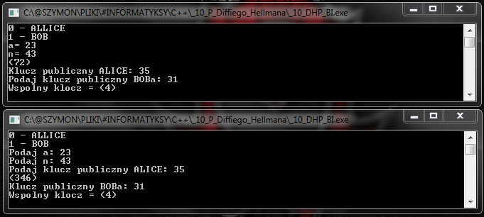

# D.H.P
Diffie-Hellman Protocole (PL)

Protokół Diffiego-Hellmana to sposób na jawne ustalanie wspólnego tajnego klucza między dwoma użytkownikami.  
W moim progrmaie komunikacja zachodzi między ALICE która inicjuje komunikację i BOBem, który odpowiada.  
  
Ogólna zasada działania protokołu:  

  
Filmik pokazujący działanie algorytmu:  

  
Używanie programu:  
-Program _10_DHP_BI.exe należy uruchimić w dwóch oknach  
-Ustawić numer urzytkownika w każdym z nich (0-ALICE, 1-BOB)  
-Zasymulować komunikację- do okna BOBa podać a,n i publiczny klucz ALICE, następnie zwrócić klucz publiczny BOBa  
-Liczby w nawiasach to klucze prywatne, które powinny byś ukryte  
-Oba okna uzyskają ten sam klucz wynikowy.  
  
Przykładowe dziełanie konsoli:  
    
  
Uwagi techniczne:  
-progrm używa biloteki BigIntiger z powodu dużych liczb momentami pojawiających się podczas działania programu (podczas potengowania).  
-poza tym używa funkcji rGen() i rGenPrime() z mojej biblioteki Resource.hpp (funkcje losujące z urzyciem random.h).  
-powinienem użyć algorytmu potęgowania z resztą, ale jak to pisałem to do jeszcze nie znałem, więc jest napisane na około (najpierw potęgownie, a potem reszta, przez co muszę używać BigIntiger'a).  
-nie jestem pewien czy działa całkowicie dobrze, bo stosunkowo często kluczem wspólnym okazuje się 1 albo któryś z kluczy publicznych.  
-program ma wykomentowane dużo 'printów' operacji które wykonuje.  
